# 📝 Deploy de WordPress com MariaDB no Kubernets

Este projeto realiza a implantação de um ambiente WordPress com banco de dados MariaDB utilizando Kubernet's, com separação clara de responsabilidades, persistência de dados, gerenciamento seguro de senhas e acesso externo via NodePort.

---

## ➡️ Instalação 

Os comando para instalação do kubernets utilizado, foi: 
```bash
sudo apt install curl apt-transport-https

curl -LO "https://dl.k8s.io/release/$(curl -L -s
https://dl.k8s.io/release/stable.txt)/bin/linux/amd64/kubectl"
chmod +x kubectl
sudo mv kubectl /usr/local/bin/

curl -LO https://storage.googleapis.com/minikube/releases/latest/minikube-linuxamd64
sudo install minikube-linux-amd64 /usr/local/bin/minikube

minikube start --driver=docker

kubectl get nodes
```

---

## 📂 Estrutura dos Arquivos

O projeto está dividido em múltiplos arquivos YAML, organizados por funcionalidade:

| Arquivo                     | Descrição                                                                 |
|----------------------------|---------------------------------------------------------------------------|
| `00-namespace.yaml`        | Cria o namespace `blog` para isolar os recursos do projeto.               |
| `01-secret.yaml`           | Armazena as credenciais do banco de dados MariaDB de forma segura.        |
| `02-pvc-mariadb.yaml`      | PersistentVolumeClaim para armazenamento do MariaDB.                      |
| `03-pvc-wordpress.yaml`    | PersistentVolumeClaim para armazenamento do WordPress.                    |
| `04-deploy-mariadb.yaml`   | Cria o Deployment do MariaDB com volume persistente e variáveis secretas. |
| `05-svc-mariadb.yaml`      | Service interno (ClusterIP) para o banco de dados MariaDB.                |
| `06-deploy-wordpress.yaml` | Cria o Deployment do WordPress com volume persistente e acesso ao banco.  |
| `07-svc-wordpress.yaml`    | Service externo (NodePort) para acessar o WordPress no navegador.         |

---

## 🚀 Como Aplicar os Arquivos

1. **Crie o namespace**:
   ```bash
   kubectl apply -f 00-namespace.yaml
   ```

2. **Aplique os recursos na ordem correta**:
   ```bash
   kubectl apply -f 01-secret.yaml
   kubectl apply -f 02-pvc-mariadb.yaml
   kubectl apply -f 03-pvc-wordpress.yaml
   kubectl apply -f 04-deploy-mariadb.yaml
   kubectl apply -f 05-svc-mariadb.yaml
   kubectl apply -f 06-deploy-wordpress.yaml
   kubectl apply -f 07-svc-wordpress.yaml
   ```

3. **Verifique se os pods estão rodando**:
   ```bash
   kubectl get pods -n blog
   ```

4. **Acesse o WordPress no navegador**:
   - Se estiver rodando em um ambiente local (como Minikube), use:
     ```bash
     minikube service wordpress-svc -n blog
     ```
   - Ou acesse via IP do Node e porta `30080`.

### Requisitos 
- _Docker_ instalado
- _Minikube_ instalado
- _kubectl_ instalado


> Você pode verificar se tudo foi instalado corretamente com:
> ```bash
> docker --version
> kubectl version --client
> minikube version
> ```

Iniciar Minikube: **minikube start**
Parar (preserva dados dos PVCs): **minikube stop**
Deletar (remove tudo): **minikube delete**


---

## ⚙️ Recursos Utilizados

- Kubernet's
- WordPress (imagem oficial `wordpress:6.5-apache`)
- MariaDB (imagem oficial `mariadb:11`)
- PVC para persistência de dados
- Secret para armazenar credenciais de forma segura
- Namespace para isolamento dos recursos
- Services (ClusterIP e NodePort)

---

## 🔧 Comandos Utilizados

```bash
kubectl apply -f 00-namespace.yaml
kubectl apply -f 01-secret.yaml
kubectl apply -f 02-pvc-mariadb.yaml
kubectl apply -f 03-pvc-wordpress.yaml
kubectl apply -f 04-deploy-mariadb.yaml
kubectl apply -f 05-svc-mariadb.yaml
kubectl apply -f 06-deploy-wordpress.yaml
kubectl apply -f 07-svc-wordpress.yaml
```

### Testar e Inspecionar Recursos

```bash
kubectl get all -n blog
kubectl describe pod <nome-do-pod> -n blog
kubectl logs <nome-do-pod> -n blog
kubectl exec -it <nome-do-pod> -n blog -- /bin/bash
```

### Recursos do Kubernet´s Utilizados

| Recurso      | Finalidade                                                                        |
| ------------ | --------------------------------------------------------------------------------- |
| `Namespace`  | Isolamento lógico dos recursos do projeto.                                        |
| `Secret`     | Armazenamento seguro de credenciais (senha do banco, usuário, etc).               |
| `PVC`        | Armazenamento persistente para banco de dados e arquivos do WordPress.            |
| `Deployment` | Gerenciamento dos pods (WordPress e MariaDB), garantindo alta disponibilidade.    |
| `Service`    | Comunicação entre os serviços (ClusterIP para MariaDB e NodePort para WordPress). |

---


## 🧠 Explicações Técnicas

A integração entre WordPress e MariaDB usando Kubernet's Deployments com Persistent Volumes (PVC) representa uma orquestração realista de serviços em ambientes de produção. Essa configuração permite a execução de aplicações web com banco de dados, mantendo persistência de dados, alta disponibilidade e modularidade na gestão dos recursos.

### 🔧 O que é?

Essa integração envolve:

- Um Deployment do WordPress, responsável por servir o CMS (Content Management System) aos usuários.

- Um Deployment do MariaDB, que atua como banco de dados relacional para armazenar dados do WordPress.

- Persistent Volumes Claims (PVCs) associados a cada serviço, garantindo que os dados não se percam mesmo que os pods sejam reiniciados ou reimplantados.

- Comunicação entre os serviços via Service, permitindo que o WordPress se conecte ao banco MariaDB internamente, de forma estável.

### 🧰 Para que serve?

Essa arquitetura serve para:

- Demonstrar uma aplicação real completa dentro de um cluster Kubernet's.

- Separar as responsabilidades entre frontend (WordPress) e backend (MariaDB).

- Garantir a persistência dos dados com volumes vinculados aos pods.

- Permitir escalabilidade, atualização e manutenção independentes entre banco e aplicação.

### 📍 Onde usar?

É amplamente usada em:

- Ambientes de desenvolvimento e testes com simulação real de produção.

- Ambientes de produção com múltiplos serviços interdependentes.

- Plataformas de hospedagem de sites gerenciados com WordPress.

- Sistemas onde a persistência de dados é crítica e a orquestração de containers é necessária.

### 📌 Benefícios da abordagem com Kubernet's:

✅ Escalabilidade Horizontal: os pods podem ser replicados para lidar com picos de tráfego.

✅ Recuperação automática: o Kubernet's reinicia automaticamente os pods com falhas.

✅ Configurações isoladas: variáveis de ambiente e secrets permitem separar configuração do código.

✅ Resiliência e alta disponibilidade: mesmo com falhas, o sistema se mantém operante.

> 💡 Nota: Com o uso de PVCs, mesmo que o banco de dados ou o WordPress seja reiniciado, os dados permanecem salvos — algo essencial para aplicações reais.

---

## 🧪 Testes Realizados

### Acessar o Word_Press:

```bash
minikube service -n blog wordpress-svc
```


> Você envia (ou reaplica) o arquivo yaml com:
> ```bash
> kubectl apply -f wordpress-stack.yaml
> ```

-> **Rollout**
Processo do Kubernet's de aplicar atualizações de forma segura.
● Se você atualiza a imagem do container no Deployment,
● ou muda a quantidade de réplicas,
● o Kubernet's faz isso gradualmente, mantendo o serviço disponível.

> Como verificar se o rollout deu certo:
```bash
kubectl rollout status deployment/<nome>
```
> Esse comando junta vários recursos e mostra o estado atual de todos eles:
> ```bash
> kubectl get all -n blog
> ```


### Logs:
> Se um container crashou e foi reiniciado, você pode ver os logs da execução anterior com:
```bash
kubectl logs -p <nome-do-pod>
```
>Logs WordPress:
```bash	
kubectl -n blog logs deployment/wordpress
```
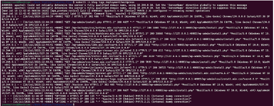
>Logs MariaDB:
```bash	
kubectl -n blog logs deployment/mariadb
```
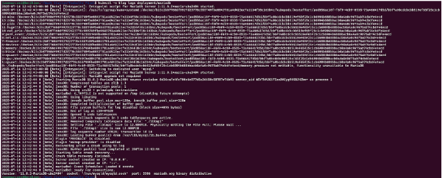

### Dashboard:
 📋 O que dá para fazer com o dashboard?
  Você pode:

- Ver o estado dos pods, deployments, services etc.

- Criar ou deletar objetos Kubernetes diretamente pela interface.

- Inspecionar logs de pods.

- Monitorar recursos (CPU/memória, se tiver metrics-server instalado).

- Aplicar arquivos YAML diretamente (via "Upload YAML").

- Ver eventos e mensagens de erro.

- Acessar shells de containers via terminal embutido.

✅ Pré-requisitos:
- Você precisa ter o minikube instalado e o cluster iniciado (minikube start).

- Também precisa do kubectl instalado para que o dashboard funcione corretamente.

> O comando é:
```bash	
minikube dashboard
```
> Depois de utilizado, ele retorna uma url em que é possível visualizar o dashboard:
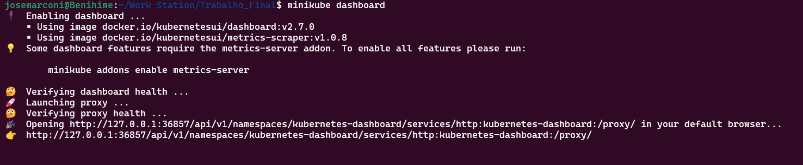

> Acessando a url, temas a seguinte tela de visualização:
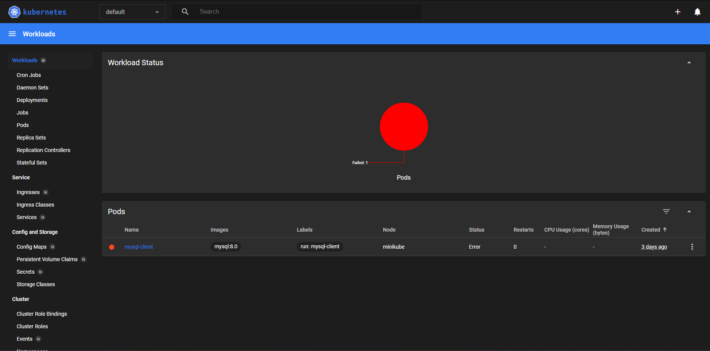

---

## ⚠️ Problemas encontrados:

No âmbito geral, foi bem tranquilo as instalações do kubernet, mas o fato dele ter como requisito o docker, atrapalhou um dos nossos integrantes do grupo, que não conseguiu pelos seguintes casos: 

> **1**
> Em caso de não funcionamento, faça a instalação do Docker via browser, baixando, através do instalador, o aplicativo.
> 
> 1- Instale o Docker Desktop:
>   - Baixe: https://www.docker.com/products/docker-desktop
>   - Siga o assistente de instalação.
>   - Durante a instalação, marque a opção “Enable integration with WSL 2”.
>     
> 2- Configure o WSL para usar o Docker Desktop:
>   - No Docker Desktop, vá em Settings > Resources > WSL Integration.
>   - Ative a integração com sua distro (ex: Ubuntu).
> 3- No terminal WSL, execute os comandos de teste de instalação

> **2**
> Caso a porta 8080 já esteja em uso, utilize outra porta para ter acesso via navegador, como a 8888. 

> **3**
> Com relação ao Kubernets mesmo, a formulção do script foi um pouco mais complicado, entretanto, seguindo pelos modelos das referências, > foi possível concluí-lo de forma que aplicação funcionasse corretamente. 

## ✅ Conclusão

A implantação do WordPress com MariaDB em um ambiente Kubernetes demonstrou de forma prática a robustez e a flexibilidade proporcionadas por ferramentas modernas de orquestração de containers. Ao utilizar recursos como Namespaces, Secrets, Persistent Volume Claims e Deployments, foi possível estruturar uma aplicação web funcional com armazenamento persistente, segurança de credenciais e isolamento de componentes.

Além disso, o uso do Minikube para simular um cluster local permitiu uma compreensão aprofundada dos fluxos de criação, monitoramento e manutenção de serviços no Kubernetes, tornando o aprendizado mais aplicável a contextos reais de produção. A organização modular dos arquivos YAML também facilitou a manutenção e reusabilidade do projeto.

Apesar de alguns desafios técnicos iniciais, como dependências de ferramentas (ex: Docker, WSL) e ajustes finos nos scripts, a experiência evidenciou os benefícios da abordagem orientada a containers, como escalabilidade, alta disponibilidade, automação de atualizações (rollout) e recuperação de falhas.

Por fim, a interface do WordPress foi plenamente acessível e funcional, evidenciando que mesmo sistemas complexos de múltiplos serviços podem ser facilmente gerenciados com o Kubernetes, reforçando sua relevância para o desenvolvimento e a operação de aplicações modernas baseadas em microserviços.

---

## Utilizando o WordPress

1- Após subir os containers, é possível acessar o a url pela porta local:
```
-- http://localhost:(porta_utilizado_no_script - Ex: 8080)/wp-admin/install.php
```

Quando feito isso, entramos na tela para começar a configurar o site, a primeira tela é para definir o idioma padrão: 
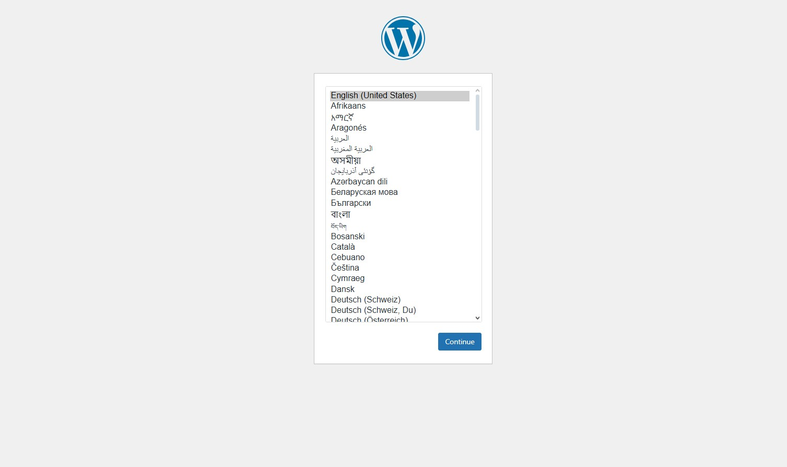

2- Definido o idioma, a tela subsequente vem para configurações iniciais do site: 
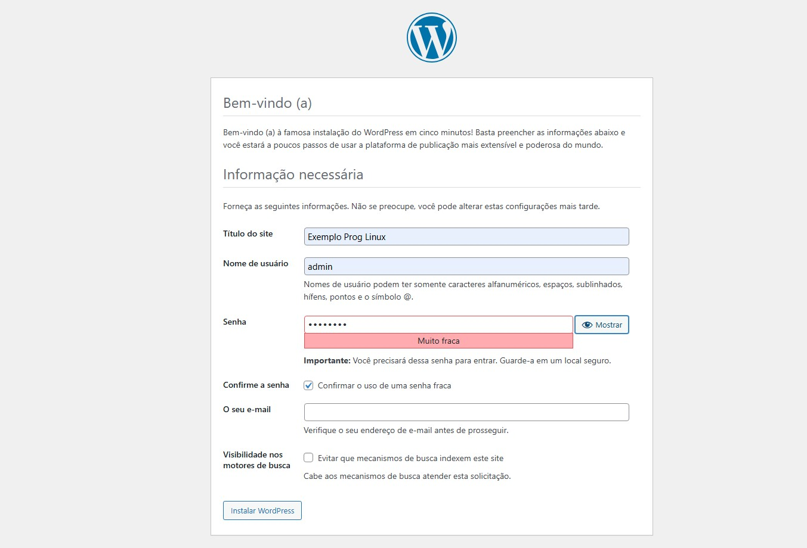

Sendo bem sucedido ele retornara na tela que foi um sucesso e um link direto para acessar e fazer login. 

3- Realizado o Login, entramos no painel principal do WordPress, onde podemos realizar toda a configuração e tematização do nosso site:
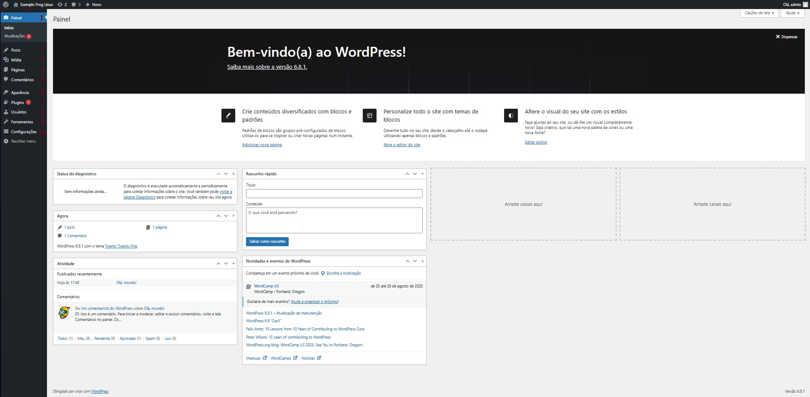

## Menu lateral do WordPress

### 1- Painel
> Área inicial de administração do WordPress. Apresenta uma visão geral do site.
>
> - **Início**: resumo de atividades recentes, rascunhos, status do sistema.
> - **Atualizações**: verifica e instala atualizações de:
>   - Core do WordPress
>   - Temas
>   - Plugins
>   - Traduções

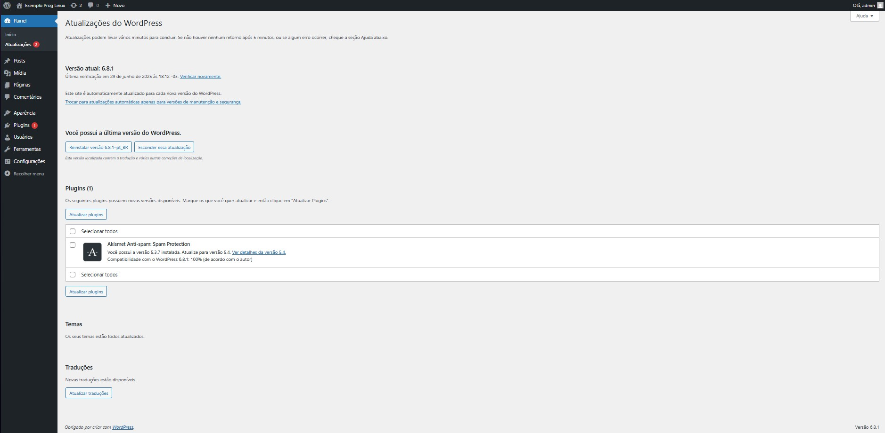

---

### 2- Posts
> Seção onde você gerencia os **posts do blog**.
>
> 1. **Todos os posts**  
>    Lista todos os artigos publicados ou em rascunho.
> 2. **Adicionar novo**  
>    Abre o editor para criar um novo post.
> 3. **Categorias**  
>    Cria ou edita categorias para organizar seus posts.
> 4. **Tags**  
>    Define palavras-chave que descrevem seus posts.

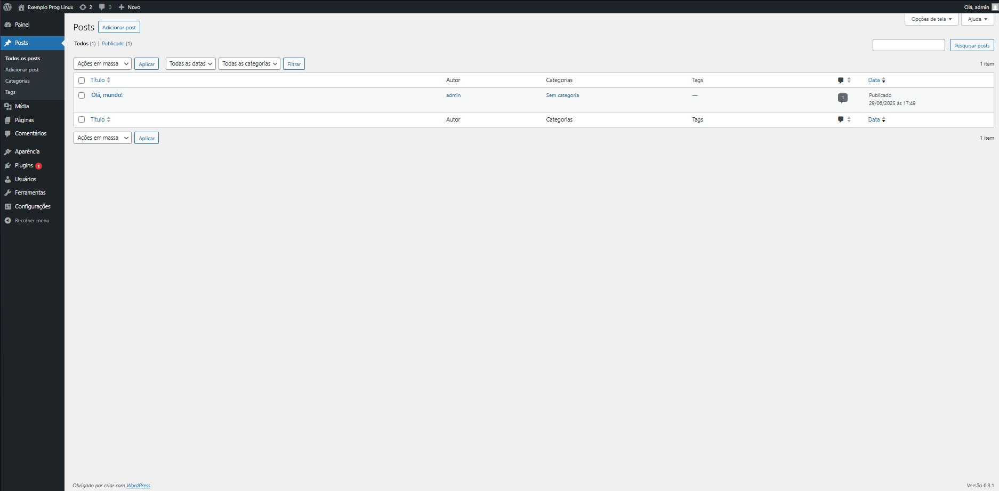

---

### 3- Mídia
> Biblioteca de **arquivos enviados**, como imagens, vídeos, PDFs.
>
> 1. **Biblioteca**  
>    Mostra todos os arquivos enviados, com opções de edição.
> 2. **Adicionar novo**  
>    Permite enviar novos arquivos diretamente.

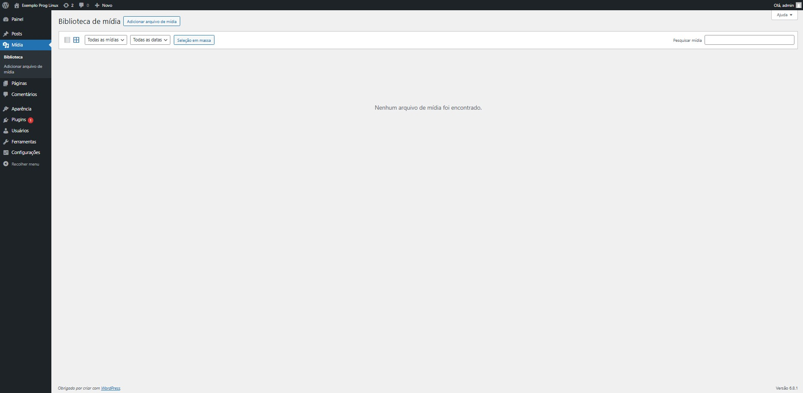

---

### 4- Páginas
> Gerencia páginas estáticas do site (ex: Sobre, Contato).
>
> 1. **Todas as páginas**  
>    Lista e permite editar/excluir páginas existentes.
> 2. **Adicionar nova**  
>    Cria uma nova página com o editor de blocos.

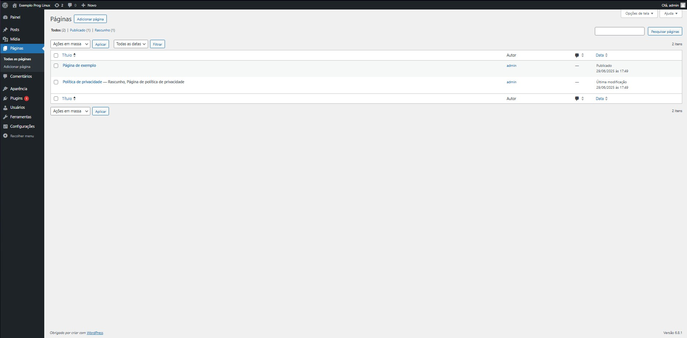

---

### 5- Comentários
> Central de **moderação de comentários** feitos por visitantes.
>
> - Aprovar, rejeitar, marcar como spam ou responder.
> - Útil para manter o conteúdo limpo e organizado.
> - Os ícones coloridos ajudam a identificar o status dos comentários.

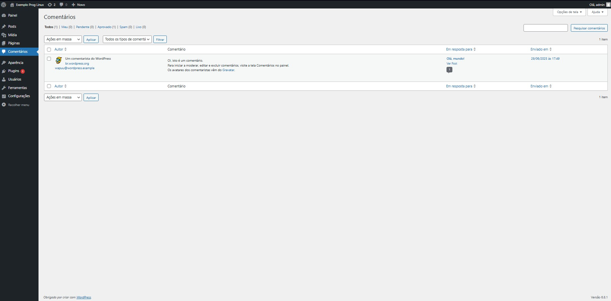

---

### 6- Aparência
> Personalização visual do site, temas e estrutura.
>
> 1. **Temas**  
>    Instala, ativa ou remove temas.
> 2. **Personalizar**  
>    Acessa o personalizador visual com pré-visualização.
> 3. **Widgets**  
>    Gerencia blocos reutilizáveis (como sidebar e rodapé).
> 4. **Menus**  
>    Cria e organiza menus de navegação.
> 5. **Editor de arquivos**  
>    (opcional) Edita diretamente os arquivos do tema. ⚠️ **Cuidado: pode quebrar o site.**

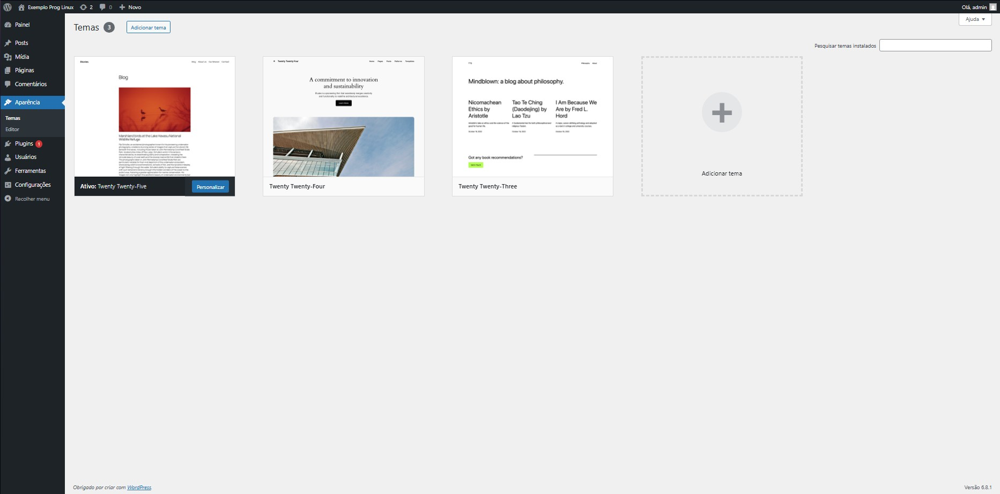

---

### 7- Plugins
> Adiciona funcionalidades extras ao WordPress.
>
> 1. **Plugins instalados**  
>    Lista e permite ativar/desativar plugins.
> 2. **Adicionar novo**  
>    Busca e instala plugins a partir do repositório oficial.
> 3. **Editor de plugins**  
>    ⚠️ Permite alterar o código dos plugins instalados.

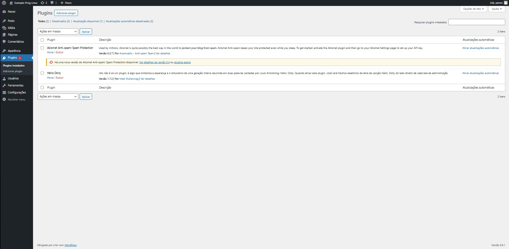

---

### 8- Usuários
> Gerencia quem pode acessar o painel e com que permissões.
>
> 1. **Todos os usuários**  
>    Lista e edita usuários cadastrados.
> 2. **Adicionar novo**  
>    Cria um novo usuário com função específica (Administrador, Editor, etc).
> 3. **Perfil**  
>    Configurações e dados do seu próprio perfil (foto, senha, etc).

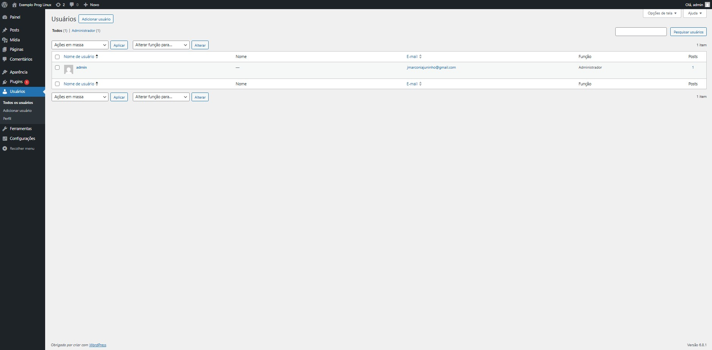

---

### 9- Ferramentas
> Conjunto de recursos administrativos diversos.
>
> 1. **Ferramentas disponíveis**  
>    Inclui funções como "Converter categorias em tags".
> 2. **Importar/Exportar**  
>    Migração de conteúdo entre sites.
> 3. **Saúde do site**  
>    Diagnóstico de performance e segurança.
> 4. **Exportar dados pessoais / Apagar dados**  
>    Ferramentas de conformidade com a LGPD/GDPR.

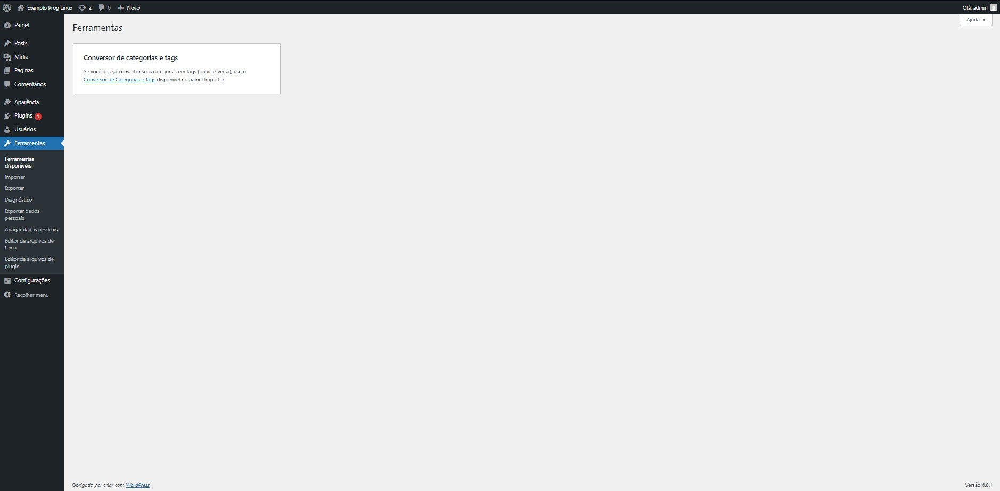

---

### 10- Configurações
> Ajustes fundamentais do site.
>
> 1. **Geral**  
>    Nome do site, URL, idioma, fuso horário.
> 2. **Escrita**  
>    Opções de publicação padrão.
> 3. **Leitura**  
>    Define qual página é a inicial e quantos posts por página.
> 4. **Discussão**  
>    Controle de comentários e moderação.
> 5. **Mídia**  
>    Tamanhos padrão para imagens.
> 6. **Links permanentes**  
>    Formato das URLs dos posts e páginas.
> 7. **Privacidade**  
>    Política de privacidade do site.

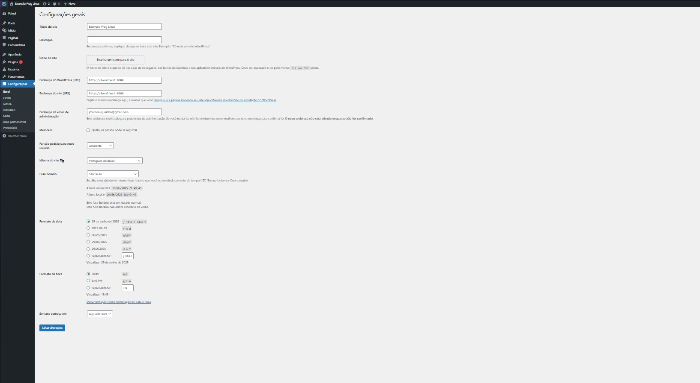

## 11 - Visualização do site
> Visualizar a página que está sendo feita
> Obs: Normalmente depois de criado o site, a url quando digitada jogará direto nessa página:


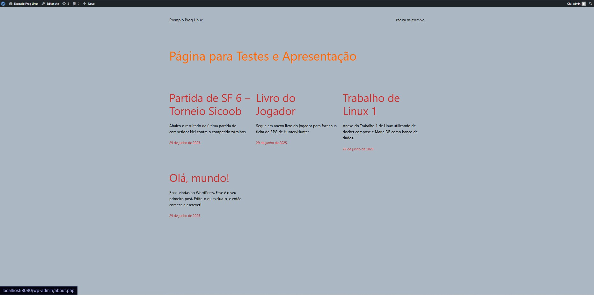

---

## ✍️ Autores

- **Felipe Parreiras e José Marconi**
- Curso: Engenharia de Computação - CEFET-MG

## 📚 Referências

- [Documentação oficial do Kubernetes](https://kubernetes.io/docs/tutorials/stateful-application/mysql-wordpress-persistent-volume/)
- [Documentação do WordPress Docker](https://hub.docker.com/_/wordpress)
- [Documentação do MariaDB Docker](https://mariadb.com/docs/server/server-management/install-and-upgrade-mariadb/installing-mariadb/binary-packages/automated-mariadb-deployment-and-administration/kubernetes-and-mariadb/kubernetes-operators-for-mariadb])
